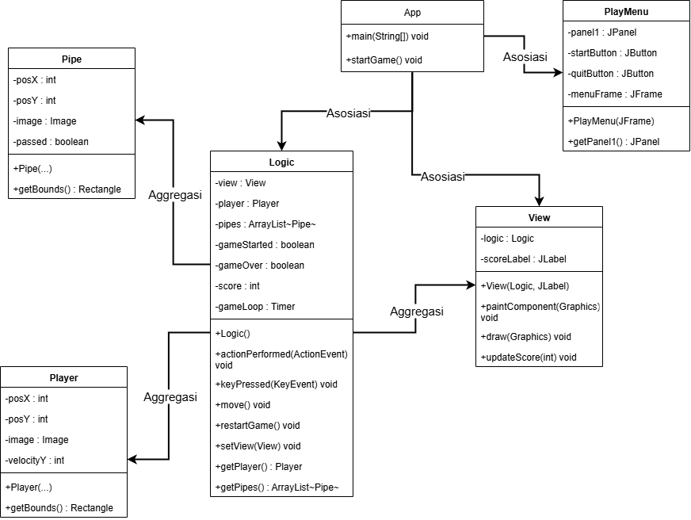

# Tugas Praktikum 7 - Desain Pemrograman Berorientasi Objek (TP7DPBO2425C1)

Saya **Mochamamd Azka Basria** dengan NIM **2405170** mengerjakan Tugas Praktikum 7 dalam mata kuliah Desain Pemrograman Berorientasi Objek untuk keberkahan-Nya maka saya tidak akan melakukan kecurangan seperti yang telah dispesifikasikan. Aamiin.

_Repository_ ini merupakan implementasi konsep OOP (_Object-Oriented Programming_) dalam bahasa **Java** menggunakan library **Java Swing**. Program ini mendemonstrasikan penggunaan konsep OOP seperti _inheritance_, _aggregation_, dan _composition_, serta implementasi _game loop_ (menggunakan `javax.swing.Timer`) dan _event handling_ (untuk input keyboard) dalam sebuah aplikasi game sederhana.

---

## Fitur Utama

- **Menu Utama:** Program dimulai dengan GUI Form yang menampilkan dua tombol: "Start" (untuk memulai game) dan "Quit" (untuk menutup aplikasi).
- **Kontrol Pemain:** Pemain dapat mengontrol burung (Player) menggunakan tombol **Spasi** untuk melompat.
- **Fisika & Gerakan:** Burung mengalami gravitasi konstan (jatuh ke bawah) dan pipa-pipa bergerak dari kanan ke kiri.
- **Game Loop:** Logika permainan dan rendering diperbarui secara konstan menggunakan `javax.swing.Timer`.
- **Deteksi Tabrakan:** Permainan akan berakhir (Game Over) jika burung menabrak pipa atau jatuh ke batas bawah layar.
- **Sistem Skor:** Pemain mendapat +1 poin setiap kali berhasil melewati sepasang pipa. Skor ditampilkan di layar.
- **Game Over & Restart:** Setelah Game Over, pemain dapat memulai ulang permainan kapan saja dengan menekan tombol **'R'**.

---

## 🛠 Konsep OOP pada Diagram

### 1\. **Class & Object**

Diagram ini memiliki **6 kelas** utama:

- `App`
- `PlayMenu`
- `Logic`
- `View`
- `Player`
- `Pipe`

Masing-masing kelas berfungsi sebagai **blueprint** untuk membuat objek yang merepresentasikan komponen spesifik dalam game (misalnya, `Logic` sebagai otak, `View` sebagai tampilan, `Player` sebagai objek pemain).

---

### 2\. **Inheritance (Pewarisan)**

- `View` **extends** `JPanel`
  - Ini adalah relasi **Inheritance**. `View` mewarisi semua kemampuan dari `JPanel` (seperti kemampuan untuk digambar di layar) dan kemudian menambahkan fungsionalitasnya sendiri (menggambar burung, pipa, dll).

---

### 3\. **Composition (Komposisi)**

- `Logic` memiliki hubungan **Komposisi** dengan `Player` dan `Pipe`.
  - Artinya, `Logic` _membuat_ (`new`) dan _memiliki_ objek `Player` dan `ArrayList<Pipe>`. Jika objek `Logic` dihancurkan, objek `Player` dan `Pipe` yang terkait juga akan ikut hancur.
- `PlayMenu` memiliki hubungan **Komposisi** dengan `JPanel` dan `JButton`.
  - Panel dan tombol-tombol adalah bagian internal yang tidak terpisahkan dari `PlayMenu`.

---

### 4\. **Aggregation (Agregasi)**

- `View` memiliki hubungan **Agregasi** dengan `Logic` dan `JLabel`.
  - `View` _memegang_ referensi ke `Logic` (untuk mendapatkan data yang akan digambar) dan `JLabel` (untuk memperbarui skor). Objek-objek ini dibuat di luar `View` (di dalam `App`).
- `Logic` memiliki hubungan **Agregasi** dengan `View`.
  - `Logic` _memegang_ referensi ke `View` (diterima melalui `setView()`) agar bisa memanggil `view.repaint()` setiap kali game loop berjalan.
- `PlayMenu` memiliki hubungan **Agregasi** dengan `JFrame`.
  - `PlayMenu` _memegang_ referensi ke `JFrame` (diterima melalui constructor) agar bisa menutup jendela menu saat game dimulai.

---

### 5\. **Constructor**

Setiap kelas menggunakan **constructor** untuk menginisialisasi state awalnya:

- `PlayMenu(JFrame frame)` menerima `JFrame` agar bisa berinteraksi dengannya.
- `View(Logic logic, JLabel scoreLabel)` menerima `Logic` dan `JLabel` agar bisa terhubung dengan data game dan UI.
- `Logic()` menginisialisasi semua variabel game (posisi player, list pipa, timer, dll).
- `Player(...)` dan `Pipe(...)` menginisialisasi posisi, gambar, dan atribut lainnya.

---

### 6\. **Encapsulation (Enkapsulasi)**

- Sebagian besar atribut pada kelas (`Player`, `Pipe`, `Logic`, `View`) dibuat **private**.
- Akses ke atribut-atribut ini diatur melalui method **public** (misalnya `getPosX()`, `setVelocityY()`, `isGameOver()`).
- Hal ini menjaga data tetap valid dan mencegah modifikasi yang tidak diinginkan dari luar kelas.

---

### 7\. **Polymorphism (Polimorfisme)**

- **Melalui Inheritance:** `View` meng-**override** method `paintComponent(Graphics g)` dari `JPanel`. Ini adalah _runtime polymorphism_. `JFrame` memanggil `paintComponent` pada `View` tanpa tahu detail spesifik tentang cara `View` menggambar burung atau pipa.
- **Melalui Interface:** `Logic` meng-**implementasi** interface `ActionListener` dan `KeyListener`.
  - `Logic` menyediakan implementasi spesifik untuk `actionPerformed(ActionEvent e)` (untuk game loop) dan `keyPressed(KeyEvent e)` (untuk input).

---

### 8\. **Array / List of Objects**

- `Logic` menggunakan `ArrayList<Pipe>` untuk menyimpan dan mengelola semua objek pipa yang sedang aktif di layar.
- Ini memudahkan operasi seperti:
  - Menggambar semua pipa (iterasi).
  - Memperbarui posisi semua pipa.
  - Mengecek tabrakan player dengan setiap pipa.

---

### Ilustrasi Diagram



---

## 📂 Struktur Proyek

```
.
├── .idea/
├── out/
│   └── ...
├── src/
│   ├── assets/
│   │   ├── background.png
│   │   ├── bird.png
│   │   ├── lowerPipe.png
│   │   └── upperPipe.png
│   ├── App.java
│   ├── Logic.java
│   ├── Pipe.java
│   ├── Player.java
│   ├── View.java
│   └── PlayMenu/
│       ├── PlayMenu.java
│       └── PlayMenu.form
├── Dokumentasi
├── .gitignore
└── FlappyBirdReborn.iml
```

---

## 📌 Desain dan Alur Kerja

### **Desain Class**

- **`App` (Driver Class):**

  - **Atribut:** (Tidak ada).
  - **Method:** `main(String[])`, `startGame()`.
  - **Tanggung Jawab:** Titik masuk program. Merakit dan meluncurkan `PlayMenu`, lalu merakit dan meluncurkan `Logic`, `View`, dan `JFrame` game saat `startGame()` dipanggil.

- **`PlayMenu` (Menu Controller/View):**

  - **Atribut:** `panel1`, `startButton`, `quitButton`, `menuFrame`.
  - **Method:** `PlayMenu(JFrame)`, `getPanel1()`.
  - **Tanggung Jawab:** Menampilkan menu utama. Mendengarkan input tombol "Start" (untuk memanggil `App.startGame()`) dan "Quit" (untuk keluar).

- **`Logic` (Game Controller/Model):**

  - **Atribut:** `view`, `player`, `pipes`, `gameStarted`, `gameOver`, `score`, `gameLoop`, `pipesCooldown`, `gravity`, dll.
  - **Method:** `Logic()`, `actionPerformed()`, `keyPressed()`, `move()`, `placePipes()`, `restartGame()`, `getters/setters`.
  - **Tanggung Jawab:** Otak dari game. Mengelola semua state (skor, status game), menjalankan fisika (gravitasi), menggerakkan objek, mendeteksi tabrakan, dan merespon input keyboard.

- **`View` (Game View):**

  - **Atribut:** `logic`, `scoreLabel`, `width`, `height`.
  - **Method:** `View(Logic, JLabel)`, `paintComponent(Graphics)`, `draw(Graphics)`, `updateScore(int)`.
  - **Tanggung Jawab:** Menggambar semua elemen visual ke layar (background, player, pipa, teks UI) berdasarkan data yang diambil dari `Logic`.

- **`Player` (Model Class):**

  - **Atribut:** `posX`, `posY`, `width`, `height`, `image`, `velocityY`.
  - **Method:** `Player(...)`, `getBounds()`, `getters/setters`.
  - **Tanggung Jawab:** Menyimpan data dan state untuk objek burung.

- **`Pipe` (Model Class):**

  - **Atribut:** `posX`, `posY`, `width`, `height`, `image`, `passed`.
  - **Method:** `Pipe(...)`, `getBounds()`, `getters/setters`.
  - **Tanggung Jawab:** Menyimpan data dan state untuk objek pipa.

### **Alur Kerja**

1.  **Inisialisasi:** Program dieksekusi melalui `App.main()`.
2.  **Tampilan Menu:** `App` membuat `JFrame` dan `PlayMenu`. Menu utama dengan tombol "Start" dan "Quit" ditampilkan.
3.  **Input Menu:**
    - Jika "Quit" diklik, program `System.exit(0)`.
    - Jika "Start" diklik, `PlayMenu` memanggil `App.startGame()`, lalu jendela menu ditutup (`dispose()`).
4.  **Inisialisasi Game:** `App.startGame()` membuat `JFrame` baru, `Logic`, `View`, dan `JLabel` untuk skor. Semua kelas dihubungkan (misalnya `logic.setView(view)`). Jendela game ditampilkan.
5.  **Menunggu Mulai:** Game dalam kondisi `gameStarted = false`. Teks "Press Space to Start" ditampilkan. Burung tidak jatuh.
6.  **Game Dimulai:** Pemain menekan **Spasi**.
    - `Logic.keyPressed()` mendeteksi ini.
    - `gameStarted` di-set ke `true`.
    - `pipesCooldown` (Timer untuk memunculkan pipa) dimulai.
    - Burung melompat untuk pertama kalinya.
7.  **Game Loop:**
    - `gameLoop` (Timer) berdetak \~60 kali per detik, memanggil `Logic.actionPerformed()`.
    - `Logic.actionPerformed()` memanggil `Logic.move()` dan `view.repaint()`.
    - Di dalam `Logic.move()`:
      - Gravitasi diterapkan ke `player`.
      - Posisi semua `pipes` di-update (bergerak ke kiri).
      - Deteksi tabrakan (player vs pipa/tanah) dijalankan.
      - Pengecekan skor (player melewati pipa) dijalankan.
    - `view.repaint()` memanggil `View.draw()` untuk menggambar ulang semua elemen di posisi baru.
8.  **Game Over:**
    - Jika tabrakan terdeteksi, `gameOver` di-set ke `true`.
    - `gameLoop` dan `pipesCooldown` dihentikan (`stop()`).
    - `View` menggambar teks "Game Over" dan "Press 'R' to Restart".
9.  **Restart:**
    - Pemain menekan tombol **'R'**.
    - `Logic.keyPressed()` mendeteksi ini dan memanggil `Logic.restartGame()`.
    - `restartGame()` me-reset semua variabel (posisi player, skor, list pipa, `gameStarted`, `gameOver`) ke kondisi awal.
    - `gameLoop` dimulai lagi, dan alur kembali ke langkah 5 (Menunggu Mulai).

---

# Dokumentasi Program

[Lihat Demo](Dokumentasi/demo.mp4)
